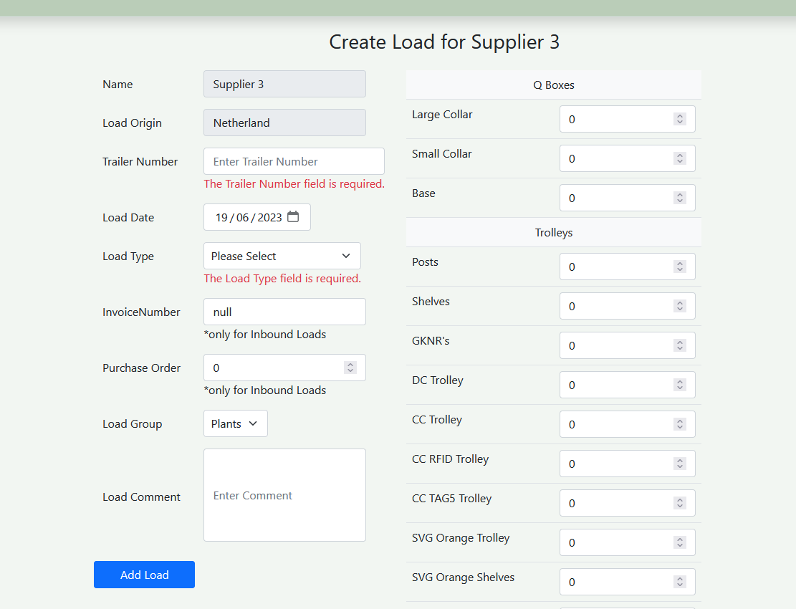

# FustWebApp

Site was created for inventory management. 
Available operations:
- Create/Update/Delete
  - Users/User Roles
  - Loads
  - Suppliers
  - Inventory Items

- Track Any item movement
- User activity log
- Do adjustment in application (increase/reduce item stockholding)
- Display Item stockholding and value

## Deployed Site 
- Username: Admin
- Password: Admin123*

[Site](https://fustdemo.azurewebsites.net)

## Screenshots 
<picture>

</picture>
<picture>
  
</picture>
<picture>
  
</picture>
<picture>
  
</picture>
<picture>
  
</picture>
<picture>
  
</picture>
<picture>
  
</picture>
<picture>
  
</picture>
<picture>
  
</picture>

